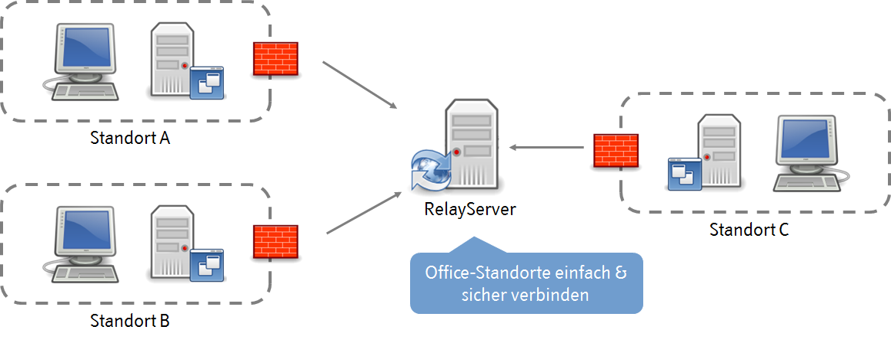

# [Was ist der Thinktecture RelayServer?](1-was-ist-der-thinktecture-relayserver.md)

Der Thinktecture RelayServer (nachfolgend kurz RelayServer genannt) ermöglicht als Open Source Software eine bi-direktionale, sichere Kommunikation von Clients, mobilen Endgeräten und Applikationen mit On-Premises Applikationen hinter Routern und Firewalls über das https-Protokoll bei vollständiger zentraler Kontrolle und Auditierung der zulässigen Teilnehmer und der erlaubten Daten.

Dafür bildet der Relay Dienst auf einem für Client und On-Premises Applikationen gleichermaßen erreichbaren Server einen sicheren Austauschpunkt für Nachrichten. Da der Server unter der vollen Kontrolle des Betreibers steht und sowohl mit Client als auch On-Premises Applikationen durchgängig verschlüsselt kommuniziert, ist die Sicherheit der übertragenen Daten jederzeit gewährleistet.

Die Positionierung des RelayServers im öffentlichen Internet sorgt weiterhin dafür, dass sowohl Client als auch On-Premises Applikationen nur ausgehende Verbindungen zur Kommunikation aufbauen müssen. Damit sind Firewalls, Router und NAT-Systeme in der Regel ebenso wenig ein Problem, wie häufig wechselnde IP-Adressen von einfachen DSL-Anschlüssen oder Mobilfunkverbindungen.

# Vorteile des RelayServers

- Open Source Software
- Vollständige Datenhoheit liegt beim Betreiber des RelayServers
- Als reine Softwarelösung schnell implementierbar
- Für die Client-Software keine Libraries notwendig
- Die Lösung ist Mandantenfähig, so dass über einen RelayServer Daten für mehrere verschiedenen On-Premises Applikationen und deren Clients fließen können
- Firewalls, NAT und Proxies stellen in der Regel kein Problem dar
- Der Datentransport ist mit https verschlüsselt
- Die On-Premises Applikation benötigt ausschließlich eine offene https-out Möglichkeit
- Keine spezielle Hardware notwendig
- Keine Firewalländerungen notwendig
- Keine Datenhaltung in einer DMZ notwendig

# Zielsetzung des RelayServers

Die Anforderungen an Unternehmens-Applikationen haben sich in den letzten Jahren massiv verändert. Die bisherigen Applikations-Umgebungen bestehend aus Servern und Desktop-basierten Clients in einem lokalen, abgesicherten Netzwerk adressieren nicht mehr die aktuelle Realität.

Unternehmen und Anwender verlangen von ihren Lösungs-Anbietern konkrete Antworten zu diesen wesentlichen Herausforderungen:

## Herausforderung: Sicherer mobiler Datenzugriff

 
Mobile Endgeräte wie Laptops, Tablets und Smartphones sind aus dem beruflichen Alltag nicht mehr wegzudenken. Beim Zugriff auf Unternehmensdaten über solche Geräte entsteht schnell der Wunsch, nicht mehr an das lokale Netzwerk gebunden zu sein. Die bisherigen Grenzen des Netzwerks müssen daher durchlässig werden, ohne dabei die Sicherheit der Unternehmensdaten zu gefährden.

Der RelayServer unterstützt dafür die sichere Verbindung von mobilen Endgeräten mit On-Premises Applikationen rein auf Basis von Software. Der On-Premises Server kann dabei über einen einfachen dynamischen DSL-Uplink oder eine 3G-Verbindung mit dem Internet verbunden sein.

## Herausforderung: Standortvernetzung

Unternehmen existieren heute meist nicht nur an einem Ort sondern erstrecken sich über viele Standorte in Form von Außenstellen oder Filialen. Aus dieser örtlichen Verteilung ergibt sich die Notwendigkeit einer effektiven Datenvernetzung, damit alle Standorte untereinander mit den gleichen Unternehmensdaten arbeiten können.

Der RelayServer sorgt für eine schnelle und unkomplizierte Vernetzung der Standorte und integriert sich dabei nahtlos in die zu vernetzende Applikation. Der On-Premises Server kann dabei über einen einfachen dynamischen DSL-Uplink oder eine 3G-Verbindung mit dem Internet verbunden sein.

## Herausforderung: Fernwartung von Geräten

Moderne Geräte sind heute mit CPUs und Storage ausgestattet und erzeugen im Betrieb Daten über ihren aktuellenZustand. Diese Daten können für die Diagnose im Fehler oder die Vorhersage von bevorstehenden Ausfällen wertvoll für den Betreiber oder Hersteller der Geräte sein. Ein abgesicherter Zugriff auf diese Daten, der aktuellen Sicherheitsstandards entspricht, lässt sich jedoch oft nicht realisieren.

Der RelayServer kann gesicherten Zugriff auf solche Geräte ermöglichen und dabei dafür sorgen, dass ausschließlich authorisierte Zugriffe in verschlüsselter Form möglich sind. Die Geräte können über einfache

# Konkurrierende Lösungsmöglichkeiten des RelayServers

## Offene Firewall-Ports

Zum Zugriff auf On-Premises Applikationen kann in der Unternehmensfirewall ein entsprechender Port geöffnet werden. Zugreifende Clients sollten sich dann über entsprechende Zertifikate bei der On-Premises Applikation oder der Firewall authorisieren, um eine sichere Kommunikation zu ermöglichen

Nachteile:

1. Firewall muss über eine statische IP oder einen DynDNS-Eintrag erreichbar sein
1. On-Premises Applikation oder die Firewall muss die Authorisierung von zugreifenden Clients mit Zertifikaten unterstützen
1. Zertifikate müssen regelmäßig erneuert und dann auf den zugreifenden Devices der Clients verteilt werden, was einen hohen logistischen Aufwand bedeutet
1. Zertifikatsmanagement auf Devices erhöht die Supportaufwände und erschwert den Anwendern die Konzentration auf ihre eigentliche Arbeit
1. Die notwendigen Firewall-Konfigurationen sind nur durch fachlich geschultes Personal durchführbar

## VPN

Virtual Private Networks (VPNs) erlauben durch die Bildung abgesicherter virtueller Netzwerke grundsätzlich eine sichere Kommunikation zwischen mobilen Clients und On-Premises Applikation.

Nachteile:

1. Vor jedem On-Premises Server ist ein VPN-Gateway notwendig, mit dem sich die VPN-Clients verbinden können. Diese Gateways bedeutet häufig größere Investitionen, die das IT-Budget des Unternehmens belasten.
1. Für die Einrichtung und die Administration von VPN-Gateways ist fachlich geschultes Personal notwendig.
1. VPNs werden häufig mit der Freigabe von entsprechenden Ports - wie unter "Offene Firewall-Ports" dargestellt - kombiniert. Dies erzeugt ein außerordentlich komplexes und kostenintensives Setup
1. Die Devices der Clients müssen den Aufbau von VPN-Verbindungen unterstützten; dazu muss häufig eine spezielle VPN-Software installiert, konfiguriert und aktuell gehalten werden.
1. Die Akzeptanz von VPNs bei Anwendern ist nicht besonders ausgeprägt, da der erfolgreiche Aufbau von VPN-Verbindungen oft als problematisch und kompliziert erlebt wird.

## Cloud Services

Über Services in der Cloud können Clients und On-Premises Applikationen einfach durch die Nutzung entsprechender Software Libraries verbunden werden. Doch auch hier gibt es einige Nachteile:

Je nach Sitz des Cloud-Anbieters und Zielbranche der Anwendung kann die Verwendung der Cloud als Relay-Punkt dem Bundesdatenschutzgesetz (BDSG) widersprechen. Auch eine Verschlüsselung des Nachrichtentransports mit SSL hilft nicht weiter, da in der Cloud die zuvor schützende SSL-Verschlüsselung für die Verarbeitung der Nachrichten aufgehoben werden muss und die Nachrichten in diesem Moment unverschlüsselt vorliegen.

Cloud Services bieten außerdem oft nur einen Minimalset an Features und berücksichtigen nicht die unterschiedlichen Anforderungen von Unternehmen. Individuelle Anpassungen sind in der Regel nicht vorgesehen.
