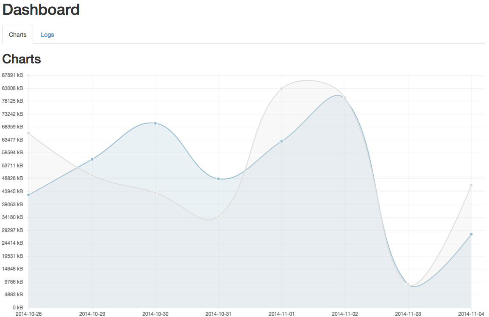
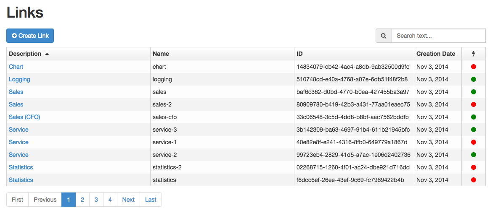
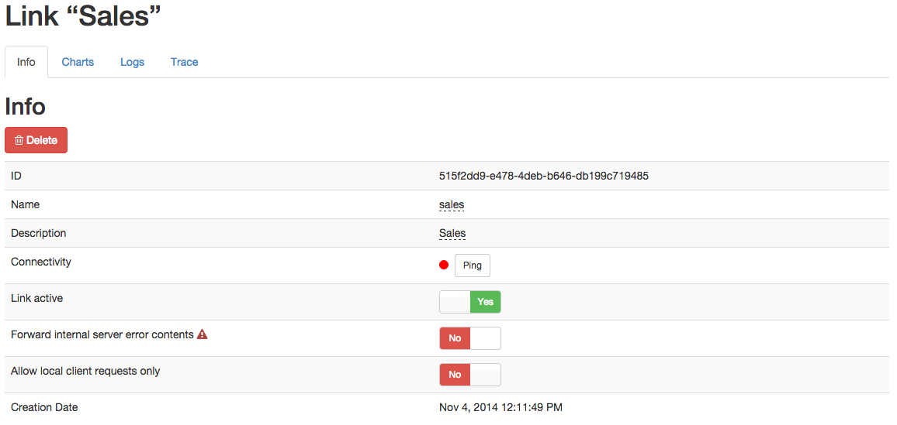
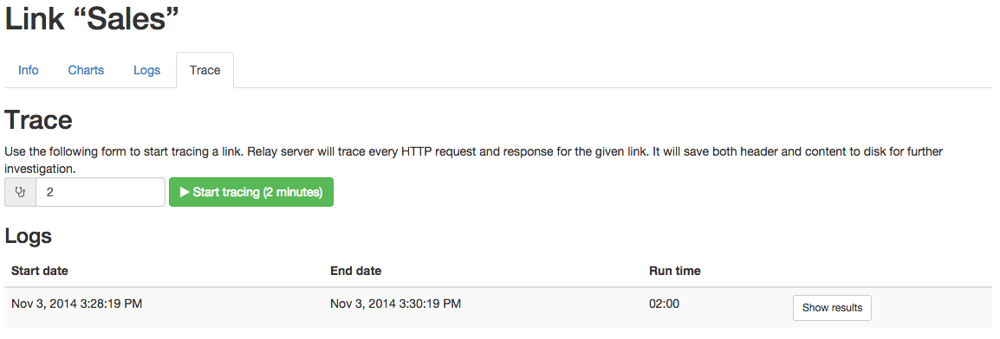
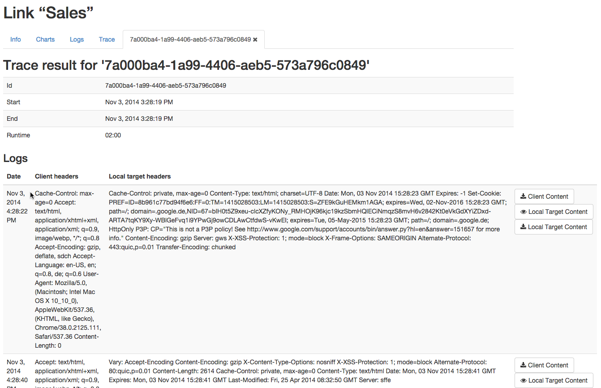

# RelayServer Management Web

Das RelayServer Management Web ist die grafische Benutzeroberfläche zur Konfiguration und Verwaltung des RelayServers durch Administratoren. Es zeigt den aktuellen Systemstatus und die historische Auslastung hinsichtlich Datenvolumen und Anzahl verbundener On-Premises Applikationen.

Für die Analyse von Betriebsproblemen steht außerdem ein umfangreiches Logging und Tracing auf Paketebene zur Verfügung, wenn dieses Feature während der Installation ausgewählt worden ist.

Das RelayServer Management Web ist auch Sicherheitsgründen standardmäßig nur lokal aufrufbar und nicht für den öffentlichen Zugriff freigeschaltet. Der erste Start erfolgt durch Aufruf der URL http://localhost:20000/managementweb/ mit einem aktuellen Browser.

## Ersteinrichtung des RelayServer Management Web

Beim ersten Aufruf des RelayServer Management Web wird automatisch die Erstkonfigurationsmaske angezeigt. Hier kann der initiale Administrator-Benutzter und das zugehörige Passwort angelegt werden.

Nach der Anlage dieses Administrations-Benutzers wird der Anwender automatisch auf die Anmeldemaske weitergeleitet.

## Anmeldung am RelayServer Management Web

Wenn der Anwender noch nicht beim RelayServer Management Web angemeldet ist, erscheint beim Aufruf des Management Webs die Anmeldemaske.

Bei der Anmeldung kann der Anwender eine dauerhaft gültige Session anfordern. Ohne aktivierte Checkbox wird die aktuelle Session beendet, sobald der Anwender den Browser schließt.

## Menüstruktur des RelayServer Management Webs

Die Navigationsleiste des RelayServer Management Webs unterteilt sich in die Bereiche

- Dashboard
- Links
- Users
- Logout

## Menüpunkt Dashboard

Nach der erfolgreichen Anmeldung sieht der Anwender das Dashboard des RelayServer Management Webs. Hier erhält man einen Überblick zum Gesamtsystem.

Der Reiter „Chart" zeigt grafisch den ein- und ausgehenden Datenverkehr der letzten 7 Tage. Jeder Tag ist dabei auf einen Datenpunkt aggregiert.

Der Reiter "Logs" zeigt die letzten 10 empfangenen Client Requests und erlaubt es, zu den einzelnen Requests detailliertere Informationen abzurufen.

## Menüpunkt Links (Provisioning)

Ein Link bezeichnet die freigeschaltete oder gesperrte Verbindung zu einer On-Premises Applikation (via On-Premises Connector).

Der Menüpunkt "Links" erlaubt die Verwaltung und Neuanlage von Links im RelayServer.

### Link Übersicht

In der Tabelle werden die folgenden Informationen bereitgestellt:

| Name | Description |
| --- | --- |
| Description | Ein frei wählbarer Name für den Link zu besseren Unterscheidung und Administation |
| Name | URL-fähiger Kurzname des Links (daher keine Sonderzeichen und keine Leerzeichen zulässig) |
| ID | Vom RelayServer für diesen Link automatisch generierte GUID. |
| Creation Date | Anlagedatum des Links |
| Connection state | Grün: On-Premises Connector ist verbundenRot: On-Premises Connector ist nicht verbunden |

Über die Suchbox ist eine schnelle Suche nach einem Link möglich. Die Suche inkludiert die Felder Description, Name und ID.

### Neuanlage eines Links

Über die Schaltfläche „Create Link" kann ein neuer Link im RelayServer angelegt werden.

Dazu muss im sich öffnenden Dialog eine Beschreibung und ein Kurzname eingegeben werden. Der Name muss dabei eindeutig sein. Es erscheint eine Fehlermeldung, wenn der eingegebene Name bereits für einen anderen Link verwendet wird.

Nach erfolgreicher Anlage eines neuen Links wird automatisch ein Passwort für den Verbindungsaufbau durch den On-Premises Connector generiert und angezeigt. Dieses Passwort muss unbedingt kopiert und in die Konfigurationsdatei des On-Premises Connectors gespeichert werden. Das Passwort kann nicht noch einmal abgefragt oder verändert werden.

### Details zu einem Link

Wenn die Description eines Links in der Tabelle angeklickt wird, so kommt man auf die Detailseite. Diese unterteilt sich in mehrere Bereiche, die nachfolgend näher beschrieben werden.

#### Info

Der erste Bereich der Detailinformationen zu einem Link ist der Info-Übersicht.

Über den Button „Delete" kann der ausgewählte Link gelöscht werden. Es erscheint eine entsprechende Sicherheitsabfrage, bevor der Link endgültig gelöscht wird. Dabei werden auch alle statistischen Informationen zum Link aus der Datenbank entfernt.

**Achtung** : das Löschen eines Links kann nicht rückgängig gemacht werden.

Folgende Informationen und Konfigurationsmöglichkeiten bietet die Info-Übersicht:

| Name | Description |
| --- | --- |
| ID | Same as above |
| Name | Same as above |
| Description | Same as above |
| Connectivity | Same as above. Additionally the Ping button allows you to send a ping through the Relay System, to check if the On-Premises Connector is reachable. If the ping is successful, the Relay System behaves as it should. If a request is still not working, the problem could be the On-Premises target. |
| Link active | Indicates if the link is enabled or not. Can be turned off temporarily to deactive a link. Relay System will behave as if the link does not exist and denies all requests to a link. |
| Forward internal server error contents | Per default RelayServer will clear the content body from a On-Premises Target response if HTTP status code is 500 to prevent leaking internal information to the clients. In case you need this information, you can turn this option on. It is strongly recommended to turn off this option when running in production. |
| Allow local client requests only | Per default this option is turned off. If you turn it on, this link will only work for requests coming from local host. This is useful, for example, if you have a Web API in front of the RelayServer which does custom authorization and authentication (especially if your On-Premises Targets don't or can't do that). With this option turned on, RelayServer will deny all public requests, so only the requests from your Web API can come through. |
| Creation Date | Same as above |

#### Charts

In the Charts screen you see the same chart as the dashboard chart. But it will show you content-in and content-out for a specific link only. Additional you can select a date range and a resolution (day, month, year) for data aggregation.

#### Logs

See dashboard logs for more details.

#### Trace

Sometimes the information the log provides is not enough and more insight is needed. Therefor you can enable link trace mode. When this mode is activated, RelayServer will trace every single HTTP request and response. It will save both header and content to disk for further investigation. Be aware that this mode can slow down your link since a lot of data will be produced, especially on highly loaded links.

You can start tracing by using the Start tracing button. It allows you to turn on trace mode for a specified length (2-10 minutes). It will be turned off automatically when the time is reached. But you can disable trace mode any time (if it is running).

If the trace is finished, refresh the page to see a new trace log entry. Click on Show results for more information about the trace results.

##### Trace result

If a trace has finished and you've opened the trace result, you'll see the following screen:

The first table shows you some information about the trace:

| Name | Description |
| --- | --- |
| Id | Internal identifier of this trace |
| Start |  Start date/time |
| End | End date/time |
| Runtime | Length of trace in MM:ss format |

Below this table you can see every single request which was done while tracing was active. The log table show the following columns:

| Name | Description |
| --- | --- |
| Date |  Date of the request |
| Client header | Header of the client's request |
| On-Premises Target header | Header of the On-Premises Target response |
| Content view | Buttons for viewing or download request or response content |

The 4 buttons within the Content view column are grouped into two functions:

View content (Eye buttons)

Download content (Download buttons)

If the content is directly viewable (normally all Content-type: text/\*) you can use the View content button to view the content in your browser directly. If this options is not available the button will not be visible.

Otherwise, you can use the Download content buttons to download the content.

## Menüpunkt Users

Das RelayServer Management Web erlaubt die Anlage mehrerer verschiedener Administrations-Benutzer. Da es in der aktuellen Version kein umfangreiches Rollenmanagement im RelayServer gibt, hat jeder angelegte User volle Administrationsrechte im Management Web.

Über die Buttons „Edit Password" kann das Passwort des entsprechenden Users neu vergeben werden. Der Button „Delete" löscht den ausgewählten User.
