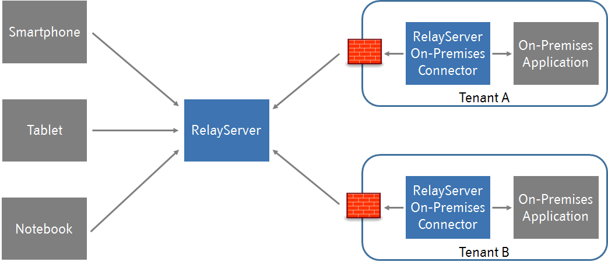

# Thinktecture RelayServer

Der Thinktecture RelayServer (nachfolgend kurz RelayServer genannt) ermöglicht als Open Source Software eine bi-direktionale, sichere Kommunikation von Clients, mobilen Endgeräten und Applikationen mit On-Premises Applikationen hinter Routern und Firewalls über das https-Protokoll bei vollständiger zentraler Kontrolle und Auditierung der zulässigen Teilnehmer und der erlaubten Daten.

Dafür bildet der Relay Dienst auf einem für Client und On-Premises Applikationen gleichermaßen erreichbaren Server einen sicheren Austauschpunkt für Nachrichten. Da der Server unter der vollen Kontrolle des Betreibers steht und sowohl mit Client als auch On-Premises Applikationen durchgängig verschlüsselt kommuniziert, ist die Sicherheit der übertragenen Daten jederzeit gewährleistet.

Die Positionierung des RelayServers im öffentlichen Internet sorgt weiterhin dafür, dass sowohl Client als auch On-Premises Applikationen nur ausgehende Verbindungen zur Kommunikation aufbauen müssen. Damit sind Firewalls, Router und NAT-Systeme in der Regel ebenso wenig ein Problem, wie häufig wechselnde IP-Adressen von einfachen DSL-Anschlüssen oder Mobilfunkverbindungen.

# Vorteile des RelayServers

- Open Source Software
- Vollständige Datenhoheit liegt beim Betreiber des RelayServers
- Als reine Softwarelösung schnell implementierbar
- Für die Client-Software keine Libraries notwendig
- Die Lösung ist Mandantenfähig, so dass über einen RelayServer Daten für mehrere verschiedenen On-Premises Applikationen und deren Clients fließen können
- Firewalls, NAT und Proxies stellen in der Regel kein Problem dar
- Der Datentransport ist mit https verschlüsselt
- Die On-Premises Applikation benötigt ausschließlich eine offene https-out Möglichkeit
- Keine spezielle Hardware notwendig
- Keine Firewalländerungen notwendig
- Keine Datenhaltung in einer DMZ notwendig
